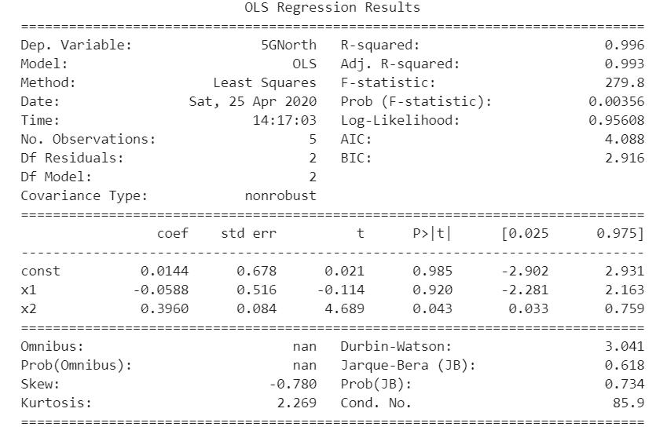
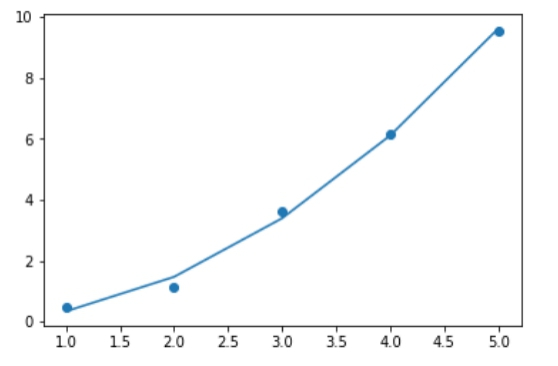
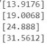

（三）高次多项式回归
=========================

1.模型类型的选择与超级参数的设置
----------------------------------
根据相关系数和上一步数据可视化后的散点图，确定用线性回归的方式来建立模型。选择Python统计分析中的常用包Statsmodels。

.. code::

    import statsmodels.api as sm

默认情况下，OLS不含截距项，可以通过如下转换方式来设置截距项这一超级参数。

.. code::

    X_add_const=sm.add_constant(X)

2.训练模型及查看其统计量
-----------------------------
以北美5G市场数据为例，进行二次多项式回归

.. code::

    X_add_const=sm.add_constant(X)
    myModel_updated=sm.OLS(y,X_add_const)
    results_updated = myModel_updated.fit()

    y_predict_updated = results_updated.predict()

3.拟合优度评价
----------------------
(1)用以下语句输出模型参数：

.. code::

    print(results_updated.summary())

发现R-squared=0.996，说明拟合程度很高。分析其他参数，如AIC等，进一步说明了模型的拟合效果很好。用三次多项式建立模型，比对模型的参数后，发现二次多项式更适合拟合这条曲线，所以选用二次多项式。

(2)通过可视化的方式查看模型回归效果

.. code::

    import matplotlib.pyplot as plt
    plt.scatter(df_data['time_series'],df_data['5GNorth'])
    plt.plot(df_data['time_series'],y_predict_updated)

4.模型的优化与重新选择
-----------------------

用R——square等统计量和数据可视化方法，查看回归效果之后，如果回归效果不好，可以更换多项式次数，即改变模型中的特征矩阵(X).

比如，将北美2G市场规模用二次多项式拟合后，发现效果不好。对比用不同次数多项式拟合的模型的精度，发现用三次多项式拟合更为精准。下面展示北美2G通过三次多项式回归的代码。

.. code::

    import numpy as np
    import pandas as pd
    import statsmodels.api as sm
    df_data = pd.read_excel("2G.xlsx")

    print(df_data['time_series'].corr(df_data['2G']))

    X=df_data['time_series']
    y=df_data['2G']
    X=np.column_stack((X,np.power(X,2),np.power(X,3)))

    X_add_const=sm.add_constant(X)
    myModel_updated=sm.OLS(y,X_add_const)
    results_updated = myModel_updated.fit()

    y_predict_updated = results_updated.predict()

    print(results_updated.summary())

    import matplotlib.pyplot as plt
    plt.scatter(df_data['time_series'],df_data['2G'])
    plt.plot(df_data['time_series'],y_predict_updated)

5.模型的应用
------------------------
用最优的模型进行预测，并输出结果。
比如对北美5G市场进行预测：

.. code::

    d=6
    print(results_updated.predict([1,d,np.power(d,2)]))
    d=7
    print(results_updated.predict([1,d,np.power(d,2)]))
    d=8
    print(results_updated.predict([1,d,np.power(d,2)]))
    d=9
    print(results_updated.predict([1,d,np.power(d,2)]))

输出预测结果如下

而对于北美整体市场规模的预测，经计算，时间序列与北美整体规模的相关系数很低，北美整体规模的散点图也显示，整体规模与时间没有线性相关关系。所以本报告分别预测2G、3G、4G的2020年市场规模，与5G加和后，计算出所预测的整体的市场规模。具体预测代码，除多项式次数根据模型参数R-squared、AIC等进行优化调整外，均相同。用此方法预测四个市场2020年的2G、3G、4G、5G以及整体市场规模。
